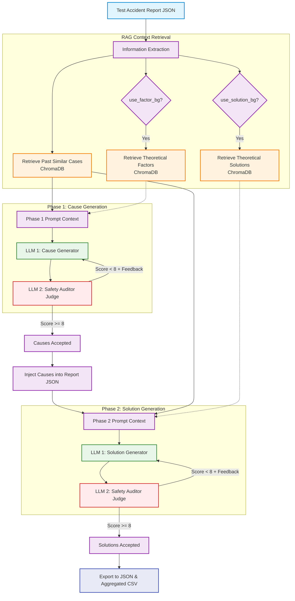
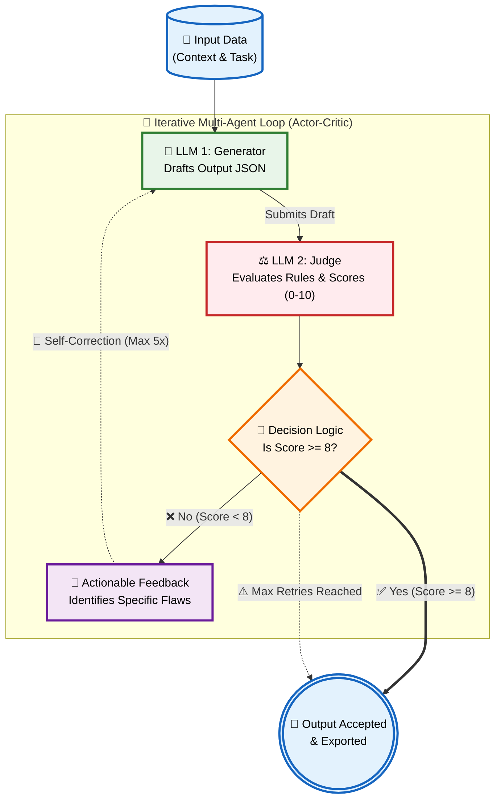

# Traffic Accident Investigation Pipeline 🚦🚗

This project is an advanced AI-powered pipeline designed to analyze traffic accident reports, systematically identify root causes, and propose effective countermeasures. It utilizes a **Multi-Agent Evaluation Loop** (Actor-Critic architecture) combined with **Retrieval-Augmented Generation (RAG)** to ensure that the generated analysis is fact-based, theoretically sound, and formatted perfectly.

---

## 📍 Overview & Workflow Flowchart

The pipeline processes unseen accident reports by pulling relevant historical context and theoretical engineering standards (if enabled). It then uses two distinct AI agents—a **Generator** and a **Judge**—to iteratively refine the causes and solutions until they meet strict engineering and structural criteria.

---

## 🛠️ Techniques & Tools Used

### 1. Retrieval-Augmented Generation (RAG)
To ensure the LLM doesn't "hallucinate" out of thin air, it is grounded with real data.
- **Past Cases Retrieval:** The system embeds the text of the current accident report and searches `dataset/train/` for historically similar accidents to see what causes and solutions were applicable in the past.
- **Theoretical Context Retrieval:** If the background variables (`use_factor_bg` and `use_solution_bg`) are enabled, the pipeline pulls formal traffic engineering principles from the catalog (`iRAP_factors.json` / `iRAP_sol_tagged.json`).
- **Tools Used:** 
  - `LangChain` for orchestrating the RAG pipeline.
  - `ChromaDB` as the local vector database.
  - `HuggingFaceEmbeddings (BAAI/bge-m3)` for highly accurate, multi-lingual text embedding.

### 2. Multi-Agent Evaluation Loop (Actor-Critic)
Relying on a single prompt often leads to inconsistent formatting or hallucinated facts. This pipeline uses two specialized agents talking to each other:
- **LLM 1 (The Generator):** Acts as a Traffic Safety AI Engineer. It drafts the causes and solutions based *strictly* on the provided facts and RAG context.
- **LLM 2 (The Strict Judge):** Acts as a Senior Traffic Safety Auditor. It reviews LLM 1's output against strict grading criteria (e.g., *Is it 100% Thai? Is it hallucinating? Is the JSON schema perfectly plain text strings?*). It scores the output from 0 to 10.
- **Feedback Loop:** If the score is below 8, the Judge provides reasoning. The Generator then takes this feedback to self-correct and try again (up to a maximum of 5 iterations).

**แผนภาพตรรกะการทำงานของลูปตรวจสอบผลลัพธ์ (Agent Loop Logic Flow):**

- **Tools Used:**
  - `Ollama` running `Qwen2.5` locally, providing cost-free and privacy-preserving LLM inference.
  - Specialized system and user prompt templates located in the `prompts/` directory.

### 3. Data Extraction & Experiment Evaluation
- The pipeline supports running multiple experimental configurations to compare the impact of RAG:
  - `Option1_NoBG`: No theoretical background injected.
  - `Option2_FactorOnly`: Only injects theoretical causes (`iRAP_factors.json`).
  - `Option3_SolutionOnly`: Only injects theoretical countermeasures (`iRAP_sol_tagged.json`).
  - `Option4_FullBG`: Injects both theoretical causes and countermeasures.
- The pipeline tracks the iteration history for *every single round* (what the Generator said, what the Judge scored, and the Judge's reasoning).
- **Tools Used:** `Pandas` is used to export this massive amount of data into an easy-to-read, long-format `experiment_evaluation_llm_judge.csv` (with `utf-8-sig` encoding) that allows researchers to Pivot, Query, and evaluate whether adding Theoretical Background actually improves the LLM's accuracy or reduces the number of iterations required to pass the Judge.

---

## 📂 Project Structure

- **`pipeline.ipynb`**: The core execution engine. Contains the setup for Models, Vector DBs, Agent Loops, and the automated Test File executor.
- **`dataset/`**: The root data directory containing:
  - `train/`: Past accident reports used as historical context for ChromaDB.
  - `test/`: Unseen accident reports to be processed by the pipeline.
  - `background/`: The theoretical catalogs (`iRAP_factors.json`, `iRAP_sol_tagged.json`) injected to improve engineering accuracy.
  - `output/`: The destination for the final `.json` reports and the aggregated `experiment_evaluation_llm_judge.csv`.
- **`prompts/`**: Markdown (`.md`) files containing precisely tuned instructions. The pipeline uses separate prompts depending on the agent (LLM1/LLM2), the target (causes/solutions), and the context configuration (no_bg/with_bg):
  - `llm1_sys.md` & `llm2_sys.md`: Core identity and operating principles.
  - `llm1_causes_no_bg.md` / `llm1_causes_with_bg.md`
  - `llm1_solutions_no_bg.md` / `llm1_solutions_with_bg.md`
  - `llm2_causes_no_bg.md` / `llm2_causes_with_bg.md`
  - `llm2_solutions_no_bg.md` / `llm2_solutions_with_bg.md`
